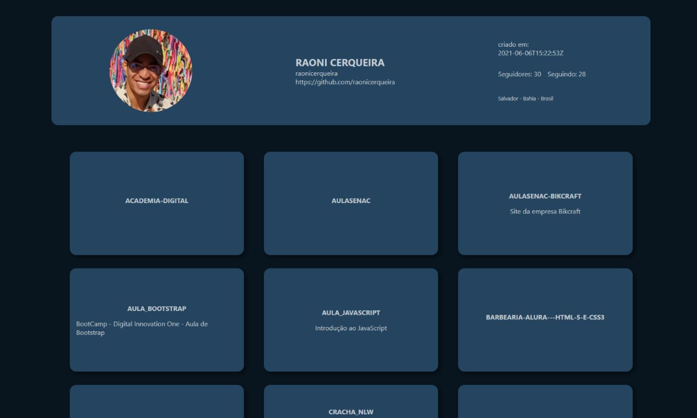

# KontHub 
## Desafio - Kontulari

O desafio proposto é um site em que seja possivel pesquisar um nome de usuário válido do GitHub e que, de forma rápida e prática seja mostrada informações dos repositórios do mesmo, caso tenha.

## Tecnologias Utilizadas

- HTML5
- CSS3
- JavaScript
- React
- NodeJS

## Tela

 

# Tutorial

1) Acesse o endereço https://github.com/raonicerqueira/konthub-api 
2) Faça download da API contida no projeto acima no seu desktop. 
3) Execute a API utilizando de preferência o IntelliJ IDEA https://www.jetbrains.com/pt-br/idea/download/ (link para download caso não possua o IntelliJ IDEA instalado no seu desktop). 
4) Clone o projeto localizado no endereço: https://github.com/raonicerqueira/konthub-front 
5) Abra o projeto usando o VSCode https://code.visualstudio.com/ (link para download caso não possua o VSCode instalado no seu desktop). 
6) Execute o comando "npm run dev" no seu terminal localizado dentro da pasta do projeto para inicializar". 
7) Pronto! Insira o nome válido de um usuario do GitHub para fazer a pesquisa.